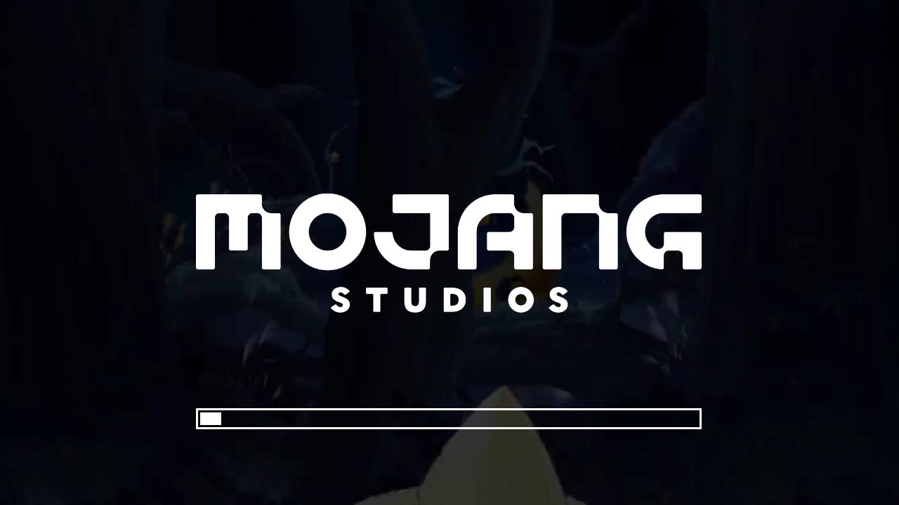
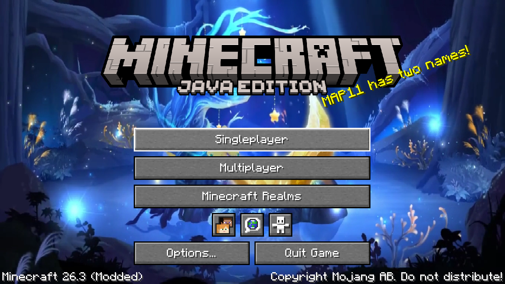
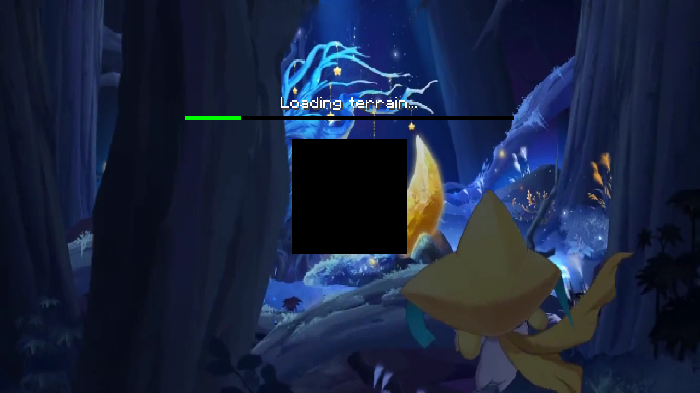
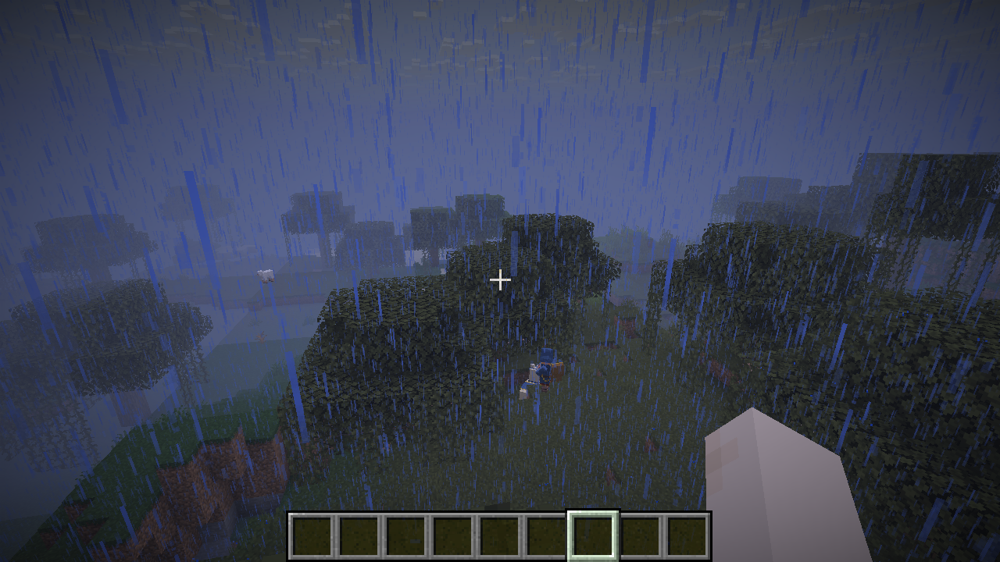
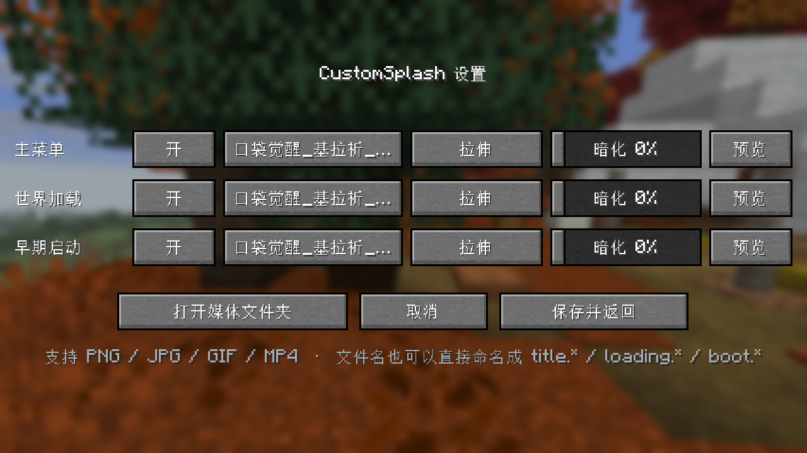
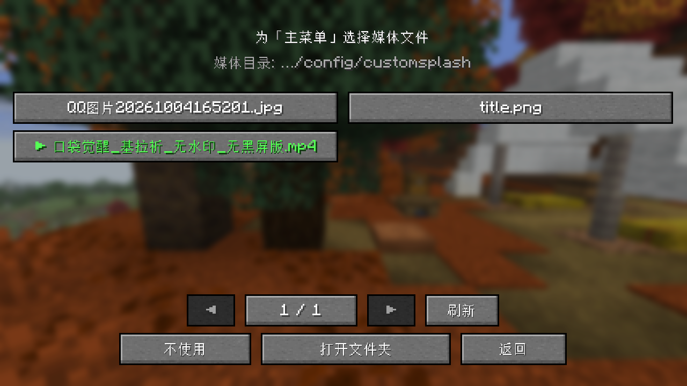

# CustomSplash · 自定义 Minecraft 启动界面（Minecraft 26.3 版）

[](https://www.minecraft.net/)
[](https://fabricmc.net/)
[](LICENSE)
[](https://github.com/miraphael/CustomSplash/releases)

用**图片 / GIF / 视频**替换 Minecraft 的启动界面，让游戏一打开就是你自己想要的画面。

> **这份代码是给 Minecraft 26.3 的。** 26.x 是一次渲染底层的大重构
> （游戏不再混淆、绘制架构换成 extractor 模式），和 1.21.x 的代码**不能共用**，
> 所以单独维护多份。想要别的版本，请到 Release 页面找对应后缀的 jar
（`+1.21.11` / `+26.2` / `+26.3`）。

---

## 简介

Minecraft 从双击启动到进入世界，中间会经过三块「等待画面」——
它们全都是固定的灰色背景加一个进度条，看久了很单调。

**CustomSplash 就是来换掉这三块画面的。**

它不需要写代码，也不需要做材质包：把图片或视频丢进一个文件夹，
在游戏里按一下 `F8` 点选就行。换完之后游戏一打开就是你的画面，
**改完立刻生效，不用重启游戏**。

支持静态图片、GIF 动图，以及**真正会动的 MP4 视频**（视频解码库已经内置在模组里，
玩家不需要安装 FFmpeg 或任何其它东西）。

### 替换了哪三块界面

| 界面 | 什么时候出现 | 配置项 |
|---|---|---|
| **早期启动屏** | 刚双击游戏、资源还在加载时，带 Mojang 标志和进度条的那个界面 | `earlyLoading` |
| **主菜单** | 有「单人游戏 / 多人游戏 / 选项」按钮的标题界面背景 | `titleScreen` |
| **世界加载界面** | 点进世界后，中间显示区块加载进度的界面 | `levelLoading` |

> 三块界面**互相独立**：可以只换其中一块，也可以三块各用不同的文件。

---

## 效果预览

以下都是 **Minecraft 26.3 实机运行截图**（背景用的是同一个 MP4 视频）：

| 早期启动屏已被替换 | 主菜单已被替换 |
|---|---|
|  |  |

| 世界加载界面已被替换 | 进入世界后（原版画面不受影响） |
|---|---|
|  |  |

| 游戏内设置界面 | 挑选媒体文件 |
|---|---|
|  |  |

| 全屏预览（视频正在播放） |
|---|
|  |

---

## 功能特性

- **三种媒体都支持** —— PNG / JPG 静态图、GIF 动图、MP4 视频（H.264）
- **零依赖** —— 视频解码库已内置在模组里，玩家不用装 FFmpeg，也不用转码
- **游戏内图形界面** —— 不用手改 JSON，按 `F8` 就能挑文件、调填充方式、调暗化、看全屏预览
- **改完立刻生效** —— 保存后马上重新加载，不用重启游戏
- **填充方式三选一** —— 铺满 / 完整 / 拉伸，不怕比例不对出现黑边
- **暗化蒙版** —— 背景太花导致菜单文字看不清时，叠一层可调的黑色蒙版
- **编码提前体检** —— 选文件时就把播不了的视频标出来，并给出一条可直接复制的 FFmpeg 转码命令
- **流畅度自适应** —— 播放速率会按机器实际解码能力自动微调，宁可慢 5% 也不卡
- **三块界面共用解码器** —— 同一个视频被三块界面引用时只解码一次，不重复吃 CPU
- **开箱即用的命名规则** —— 文件叫 `title.*` / `loading.*` / `boot.*` 就自动生效，连界面都不用开

---

## 安装

### 前置要求

| 组件 | 版本 |
|---|---|
| Minecraft | **26.3**（Java 版） |
| Java | **25**（26.x 的运行时就是 Java 25，启动器一般会自己准备好） |
| Fabric Loader | **0.19.0 以上** |
| Fabric API | 26.3 对应的版本（实测用 `0.161.0+26.3`，[下载](https://modrinth.com/mod/fabric-api)） |

### 安装步骤

1. 到 [**Releases**](https://github.com/miraphael/CustomSplash/releases) 页面，
   下载文件名带 **`+26.3`** 的那个 jar。
2. 把它放进 `.minecraft/mods/` 文件夹。
3. 启动一次游戏 —— 模组会自动创建下面这两个东西：
   ```
   .minecraft/config/customsplash.json     ← 配置文件
   .minecraft/config/customsplash/         ← 把你的图片 / 视频丢这里
   ```
4. 接下来看下面的「怎么打开」。

> **文件名里的版本号怎么看**：格式是 `customsplash-<模组版本>+<Minecraft 版本>.jar`，
> 例如 `customsplash-1.0.0+26.3.jar` 就是「模组 1.0.0 版，给 Minecraft 26.3 用的」。
> **别下错游戏版本** —— 每个 Minecraft 版本对应一个独立的 jar，装错了游戏会拒绝加载。

> 装完可以在 **模组菜单（Mod Menu）** 里看到它，作者是 **Miraphael**。

---

## 怎么打开

有**三种**方式，随便挑一种：

### 方式一：按 `F8`（最常用）

进游戏后，在主菜单或游戏里按一下 **`F8`**，就会弹出设置界面。

> `F8` 被别的模组占用了？去「选项 → 控制 → 按键绑定 → CustomSplash」里改一个没被占用的键。

### 方式二：输入指令

在聊天栏输入：

```
/customsplash config
```

### 方式三：什么都不用开，靠文件名

把文件按下面的名字放进 `.minecraft/config/customsplash/`，模组会自动识别，**连界面都不用打开**：

| 界面 | 自动识别的文件名 |
|---|---|
| 主菜单 | `title.png` / `title.jpg` / `title.gif` / `title.mp4` |
| 世界加载 | `loading.png` / `loading.jpg` / `loading.gif` / `loading.mp4` |
| 早期启动 | `boot.png` / `boot.jpg` / `boot.gif` / `boot.mp4` |

### 完整上手流程

1. 把你的图片或视频复制到 `.minecraft/config/customsplash/`
2. 进游戏，按 `F8`
3. 在对应的那一行点「文件名」按钮，选中你的文件
4. 需要的话调一下「填充」和「暗化」
5. 点底部的 **「保存并返回」** —— 立刻生效

### 全部指令

```
/customsplash config    打开设置界面（和按 F8 一样）
/customsplash reload    重新加载配置和媒体文件
/customsplash info      在聊天栏列出三块界面各自用了什么文件、有没有加载成功
```

> 放了文件却没反应？先执行 `/customsplash info`，它会告诉你每一块界面实际在用哪个文件、
> 有没有加载成功。绝大多数情况是文件名不对，或者没在界面里显式指定。

---

## 游戏内设置界面

### 主界面

三行分别对应三块界面，每行从左到右是：

| 控件 | 作用 |
|---|---|
| **开 / 关** | 这一层要不要替换。关掉就恢复成原版背景 |
| **文件名按钮** | 点进去挑文件。没选时显示「未选择」，此时按 `title.*` / `loading.*` / `boot.*` 自动查找 |
| **填充** | `铺满`(cover) / `完整`(contain) / `拉伸`(stretch) |
| **暗化滑块** | 叠一层黑色蒙版，`0% ~ 100%`。菜单文字看不清就调高 |
| **预览** | 全屏看实际效果，所见即所得 |

底部三个按钮：**打开媒体文件夹**（直接弹出资源管理器）、**取消**（丢弃本次改动）、
**保存并返回**（写回 `config/customsplash.json` 并立刻重新加载）。

> 界面里改的是一份**临时副本**，只有点「保存并返回」才会真正生效 ——
> 所以放心乱点，点「取消」就全还原了。

### 选文件界面

把媒体目录里的文件按 2 列 × 5 行列出来，每页 10 个：

- 点文件名即指派给当前这一层，并自动回到主界面
- 绿色 `▶` 标记的是这一层当前正在用的文件
- 鼠标悬停可以看到文件类型和大小
- 文件多时用底部的 `◀` / `▶` 翻页
- **不使用** —— 清空选择，恢复成按 `title.*` / `loading.*` / `boot.*` 自动查找
- **打开文件夹** —— 新拷进去文件后，回到这个界面点 **刷新** 就能看到
- 编码不是 H.264 的视频前面会挂 **`⚠`**

### 全屏预览

所见即所得地铺满整个屏幕，同时给出这个文件的「体检结论」。
如果视频确实偏慢，会提供一个「复制转码命令」按钮。

---

## 配置文件说明

`config/customsplash.json`：

```json
{
  "enabled": true,
  "mediaFolder": "config/customsplash",
  "titleScreen":  { "enabled": true, "media": "", "fit": "cover", "dim": 0.35, "speed": 1.0 },
  "levelLoading": { "enabled": true, "media": "", "fit": "cover", "dim": 0.25, "speed": 1.0 },
  "earlyLoading": { "enabled": true, "media": "", "fit": "cover", "dim": 0.10, "speed": 1.0 }
}
```

| 字段 | 含义 |
|---|---|
| `enabled` | 总开关，`false` 时模组完全不生效 |
| `mediaFolder` | 媒体目录，相对游戏根目录；也可以写绝对路径 |
| `media` | 指定文件名。**留空**则自动在目录里找 `title.*` / `loading.*` / `boot.*` |
| `fit` | 填充方式，见下表 |
| `dim` | 背景上叠一层黑色蒙版的浓度，`0` ~ `1`。调高可以让菜单文字更清楚 |
| `speed` | 播放速度倍率，只对 GIF / 视频有效 |

**`fit` 的三种取值：**

| 值 | 效果 |
|---|---|
| `cover` | 等比放大铺满全屏，超出部分裁掉。**推荐**，不会有黑边 |
| `contain` | 等比缩放到完整可见，两侧或上下留黑边 |
| `stretch` | 直接拉伸铺满，宽高比不对时画面会变形 |

---

## 支持的媒体格式

| 格式 | 扩展名 | 说明 |
|---|---|---|
| 静态图片 | `.png` `.jpg` `.jpeg` | 最推荐，性能最好 |
| GIF 动图 | `.gif` | 由 JDK 自带解码器处理，无需额外依赖 |
| 视频 | `.mp4`（**H.264**） | 基于纯 Java 的 jcodec 解码，库已内置 |

**视频只支持 H.264**。以下情况放不出来，模组会**在选择文件时就提前标出来**：

| 情况 | 解决 |
|---|---|
| HEVC (H.265) / AV1 / VP9 | 转成 H.264：`-c:v libx264 -pix_fmt yuv420p` |
| 隔行扫描（interlaced） | 转码时加 `-vf yadif` |
| 纯音频 MP4（没有视频轨） | 换一个文件 |

实测（26.x，1280×586 / 30fps 的片子）纯解码约 29 ms/帧，
播放速率自适应后稳定在 28~30 帧/秒，画面更新率接近 100%。

> 想了解「为什么能播得流畅」「一卡一卡是怎么根治的」「哪些坑只有逐像素比对才发现」，
> 请看 **[docs/TECH-NOTES.md](docs/TECH-NOTES.md)**；
> 想知道 26.x 到底改了什么、这次是怎么移植过来的，看 **[docs/PORTING-26x.md](docs/PORTING-26x.md)**。

---

## 常见问题

**Q：放进去了但是没反应？**
先执行 `/customsplash info`，它会告诉你每一块界面实际用的是哪个文件、有没有加载成功。
也可以按 `F8` 打开设置界面，文件名按钮上会直接显示当前用的是哪个文件。
最常见的原因是文件名不对 —— 必须是 `title.*` / `loading.*` / `boot.*`，或者在界面/配置里显式指定。

**Q：怎么打开设置界面？**
按 `F8`，或者输入 `/customsplash config`。`F8` 被别的模组占了的话，
去「选项 → 控制 → 按键绑定 → CustomSplash」里改一个没被占用的键。

**Q：主菜单文字看不清？**
把对应那层的 `dim` 调大（比如 `0.5`），会在背景上叠一层黑色蒙版。

**Q：视频播起来卡？**
先在预览页看体检结论 —— 如果显示「兼容性正常」那就没问题。
如果确实提示「解码偏慢」，点预览页的「复制转码命令」按钮，把命令拷到 FFmpeg 里跑一遍。
也可以改用 GIF / 静态图，或者把 `speed` 调大来加快播放。

**Q：日志里刷了一堆 `[CustomSplash]` 黄字？**
模组只在**真的有问题**时才输出告警，而且做了两层防误报：
同一个问题只说一次；流畅度要连续观察约 6 秒才下结论。
正常情况下一次游戏启动只会输出 2~3 行 `[CustomSplash]` INFO 日志。

**Q：能只换主菜单、不动启动屏吗？**
可以，把不需要的那层 `enabled` 设成 `false`。

**Q：和别的换背景的模组冲突吗？**
如果对方也是通过 Mixin 改同一个方法（26.x 里是 `extractBackground`），
可能会有冲突（谁后注入谁生效）。可以先关掉本模组对应的那一层试试。

**Q：装了之后游戏起不来 / 报「不兼容」？**
确认三件事：游戏是 **26.3**、Java 是 **25**、jar 文件名带 **`+26.3`**。
26.x 的 jar 和 1.21.x 的**完全不通用**。

---

## 从源码构建

### 环境要求

本项目已实测通过的组合（**注意 Loom 版本卡得比较死，装错了会直接构建失败**）：

| 组件 | 版本 | 说明 |
|---|---|---|
| JDK | **25** | 26.x 的运行时就是 Java 25，Loom 1.17 起也要求 JDK 25 |
| Gradle | **9.7.0** | 用自带的 wrapper 也行（`distributionUrl` 已指向腾讯镜像） |
| Fabric Loom | **1.18.2** | 已写在 `build.gradle` 里 |

> ⚠️ **两个坑**：
> 1. 插件 id 必须是 **`net.fabricmc.fabric-loom`**（no-remap 变体），
>    写成普通的 `fabric-loom` 会直接报 `Configuration 'mappings' has no dependencies`。
> 2. 26.x **不需要也不应该有 `yarn_mappings`** —— 游戏不再混淆，直接用官方类名编译。

### 构建

```bash
./gradlew build          # Windows 用 gradlew.bat build
```

产物在 `build/libs/customsplash-1.0.0+26.3.jar`（约 1.9 MB，已内置视频解码库）。

> 文件名里的 `1.0.0` 是模组版本，`26.3` 是目标 Minecraft 版本，
> 由 `gradle.properties` 的 `mod_version` 和 `minecraft_version` 自动拼出来。
> 构建**不会**再单独产出 `-sources.jar` —— 需要看源码请直接下载仓库源码，
> 或从 Release 页面底部 GitHub 自动附带的源码 zip / tar.gz 取。

只想在开发环境里试跑：

```bash
./gradlew runClient
```

`examples/title.png` 是一张示例背景图，可以直接复制到 `config/customsplash/` 下试试效果。

### 想换 Minecraft 版本？

**同一代之内**（比如 26.1 → 26.2）改 `gradle.properties` 里这几行即可，
代码基本不用动：

```properties
minecraft_version=26.3
loader_version=0.19.5
fabric_version=0.161.0+26.3
```

> ⚠️ **跨大版本（1.21.x ↔ 26.x）是另一回事** —— 类名和绘制 API 全变了，
> 得改代码。从 1.21.11 移植到 26.x 的完整对照表在
> [`docs/PORTING-26x.md`](docs/PORTING-26x.md) 里。

---

## 版本、下载与发布

**每个版本对应一个独立的 Release，互相不覆盖。**

- 下载地址固定是 [Releases 页面](https://github.com/miraphael/CustomSplash/releases)，
  永远拿最新版；想装旧版就往下翻。
- **文件名一律带目标 Minecraft 版本**，格式 `customsplash-<模组版本>+<MC 版本>.jar`：

  | tag | Release 附件 | 适用游戏 |
  |---|---|---|
  | `v1.0.0+1.21.11` | `customsplash-1.0.0+1.21.11.jar` | Minecraft 1.21.11 |
  | `v1.0.0+26.2` | `customsplash-1.0.0+26.2.jar` | Minecraft 26.2 |
  | `v1.0.0+26.3` | `customsplash-1.0.0+26.3.jar` | Minecraft 26.3 |

- 每个 Release **只挂一个模组 jar**。需要源码的话，用页面底部 GitHub 自动附带的
  `v<tag>.zip` / `v<tag>.tar.gz`，**不用**额外的源码包附件。
- 发新版本时只会**新建**一个 tag 和 Release，**不会动到任何已有的版本**。

### 发新版本怎么做

改 `gradle.properties` 里的 `mod_version`（**只写模组版本，不要写 MC 版本**），
然后跑发布脚本：

```bash
./scripts/release.sh
```

脚本会自动拼出 `1.0.1+26.3` 这样的完整版本号，然后：检查工作区干净 →
构建 → 打 tag `v<完整版本>` → 建 Release → 把模组 jar 传上去。
如果该 tag 已经存在，脚本会**拒绝执行**（避免误覆盖已发布的版本），
除非显式加 `--replace`，那样也只替换**这一个** tag 的 Release。

发布细节见 [docs/RELEASING.md](docs/RELEASING.md)，
每个版本改了什么见 [CHANGELOG.md](CHANGELOG.md)。

---

## 26.x 相对 1.21.x 都变了什么（摘要）

| 1.21.11（旧版代码） | 26.3（本项目） |
|---|---|
| `client.MinecraftClient` | `client.Minecraft` |
| `client.gui.DrawContext` | `client.gui.GuiGraphicsExtractor` |
| `render(...)` | `extractRenderState(...)` |
| `renderBackground(...)` | `extractBackground(...)` |
| `client.gui.screen.SplashOverlay` | `client.gui.screens.LoadingOverlay` |
| `client.gui.screen.TitleScreen` | `client.gui.screens.TitleScreen` |
| `client.gui.widget.ButtonWidget` | `client.gui.components.Button` |
| `client.gui.widget.CyclingButtonWidget` | `client.gui.components.CycleButton` |
| `client.option.KeyBinding` | `client.KeyMapping` |
| `text.Text` | `network.chat.Component` |
| `util.Identifier` | `resources.Identifier` |
| `texture.NativeImageBackedTexture` | `renderer.texture.DynamicTexture` |
| 需要 Yarn 映射（游戏是混淆的） | **游戏不再混淆，直接用官方类名，没有 Yarn** |

完整的逐项对照、踩到的坑和验证方法见 [`docs/PORTING-26x.md`](docs/PORTING-26x.md)。

---

## 26.3 相对 26.2 又变了什么

26.3 的**界面绘制 API 和 26.2 是同一套**，所以这份代码是从 26.2 那条分支直接开出来的，
只动了三处被 26.3 换掉的底层接口：

| 26.2 | 26.3 |
|---|---|
| `org.lwjgl.glfw.GLFW.GLFW_KEY_F8` | `InputConstants.KEY_F8`（26.3 把窗口库从 GLFW 换成了 SDL，`org.lwjgl.glfw` 整个包不再是编译依赖） |
| `InputConstants.Type.KEYSYM` / `SCANCODE` | `InputConstants.Type.KEYBOARD`（两个枚举合并成一个） |
| `Util.getPlatform().openPath(Path)` | `com.mojang.blaze3d.Blaze3D.openPath(Path)`（`openUri` 同理） |

工具链、Loom 插件、`NativeImage` 内存布局、Mixin 注入点**全部不变**。
如果你是从 26.2 的源码往 26.3 搬，照上面三行改就够了。

---

## 项目结构

```
CustomSplash-mc26/
├── build.gradle                 构建脚本（Loom 1.18.2 no-remap + jcodec）
├── gradle.properties            版本号集中在这里（注意：没有 yarn_mappings）
├── settings.gradle
├── gradlew / gradlew.bat        Gradle wrapper，不用自己装 Gradle
├── CHANGELOG.md                 每个版本改了什么
├── examples/title.png           示例背景图，可直接复制试用
├── .github/workflows/build.yml  CI：用 JDK 25 构建一遍，确认没写坏
├── scripts/
│   ├── release.sh               一键发布脚本（构建 + 打 tag + 建 Release）
│   └── run-test-client.py       直接启动本机某个 PCL 版本目录的客户端（验证用）
├── src/main/java/dev/customsplash/
│   ├── CustomSplash.java            模组入口：F8 快捷键 + /customsplash 指令
│   ├── config/SplashConfig.java     JSON 配置读写
│   ├── core/LogGate.java            日志去重，避免同一个问题刷屏
│   ├── media/
│   │   ├── FrameSource.java         帧源接口
│   │   ├── ImageFrameSource.java    PNG / JPG
│   │   ├── GifFrameSource.java      GIF（ImageIO 解码）
│   │   ├── VideoFrameSource.java    MP4（jcodec 解码，含 B 帧重排 + 双线程流水线）
│   │   ├── DecoderPool.java         同一个视频三块界面共用解码器
│   │   ├── YuvConverter.java        YUV→ARGB（逐像素对齐 jcodec 官方实现）
│   │   ├── Mp4Probe.java            只读 MP4 头，提前判断编码是否可播
│   │   ├── Images.java              图片缩放工具
│   │   └── MediaLoader.java         按配置找到文件并创建帧源
│   ├── client/
│   │   ├── MediaPlayer.java         把帧渲染成全屏背景（含 cover/contain/stretch）
│   │   ├── MediaLibrary.java        扫描媒体目录，列出可用的图片 / 视频
│   │   ├── Mp4Probe.java            选文件时提前标出播不了的视频
│   │   ├── SplashMediaManager.java  三块界面的统一管理
│   │   └── gui/
│   │       ├── SplashConfigScreen.java   主设置界面（三层各一行控件）
│   │       ├── MediaSelectScreen.java    选文件界面（2×5 分页）
│   │       └── MediaPreviewScreen.java   全屏预览
│   └── mixin/
│       ├── LoadingOverlayMixin.java       早期启动屏
│       ├── TitleScreenMixin.java          主菜单
│       └── LevelLoadingScreenMixin.java   世界加载界面
├── src/main/resources/
│   ├── fabric.mod.json
│   ├── customsplash.mixins.json
│   ├── assets/customsplash/icon.png
│   └── assets/customsplash/lang/          按键名称的中英文翻译
└── docs/
    ├── TECH-NOTES.md              实现细节与实测数据
    ├── RELEASING.md               发布流程
    ├── PORTING-26x.md             从 1.21.11 移植到 26.x 的完整记录
    └── screenshots/               实际运行截图
```

---

## 作者与许可

- 作者：**Miraphael**
- 许可：[MIT](LICENSE)

欢迎提 Issue 反馈问题。这个模组最初是为了让启动界面不那么单调而写的，
如果你有更好玩的想法（比如按时间自动切换背景），也欢迎说一声。
